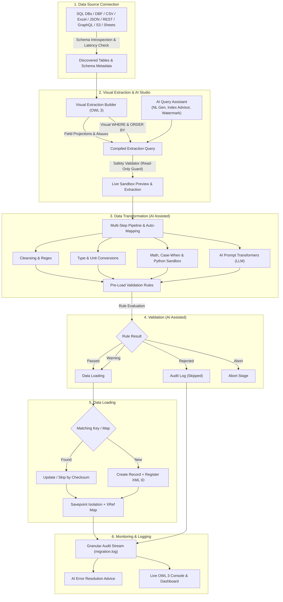

# Data Migration Tools Studio for Odoo 19 / 18

[](https://www.odoo.com)
[](https://www.gnu.org/licenses/lgpl-3.0.html)
[](https://openai.com)
[](https://github.com/odoo/owl)

**Data Migration Tools Studio** is an enterprise-grade, 6-stage ETL (Extract, Transform, Load) and data synchronization platform designed specifically for Odoo 19 and 18. It seamlessly imports, cleanses, normalizes, validates, and loads data from SQL databases, legacy ERPs, spreadsheets, REST/GraphQL APIs, cloud storage, and legacy Visual FoxPro systems.

---

## 🌟 Key Highlights

- 🔌 **Universal Source Connectors**: PostgreSQL, MySQL, MSSQL, Oracle, SQLite, ODBC, Visual FoxPro DBF with memo files, CSV, TSV, Excel, JSON, XML, REST APIs, GraphQL, AWS S3, SFTP, and Google Sheets.
- 🎨 **Visual Extraction & Query Studio**: Interactive OWL 3 visual schema explorer, column projection selector with custom aliases (`AS`) and type casting (`CAST`), dynamic visual WHERE filter builder, ORDER BY sorting, and live data preview sandbox.
- ⚡ **Incremental Extraction & Delta Watermarks**: High-speed delta tracking (`WHERE updated_at > :watermark`) across timestamps, dates, and sequential IDs.
- 🤖 **AI-Powered Query & ETL Assistants**: 
  - *Extraction Studio*: Natural Language to SQL/API Query Generator, Performance & Index Advisor (suggesting source database indexes), Watermark Advisor, and Query Risk Explainer.
  - *Transformation Studio*: Natural Language field transformers, semantic auto-mapping, and AI validation rule generation.
  - *Data Quality Health Scoring*: Automated audit score (0–100%) checking null ratios, duplicates, and format anomalies.
- 🔄 **11 Transformation Categories**: Cleansing, Normalization, Multi-pattern Date standardizer, Unit conversions (Mass, Length, Volume, Temp), Math calculations, String slicing & splitting, Slugify, Case-When branching, and Python sandbox.
- 🛡️ **Zero-Failure Savepoint Isolation & Read-Only Safety**: Row-level database savepoints (`with self.env.cr.savepoint():`) prevent individual record errors from failing entire batches, while strict query validation blocks destructive SQL statements (`DROP`, `DELETE`, `UPDATE`, `TRUNCATE`, etc.).
- 🎯 **Multi-Strategy Relational Lookups**: Automated resolution for Many2one, Many2many, and One2many by XML ID, key fields, domain expressions, or auto-creation.
- 🧪 **Dry-Run Simulation**: Run complete data extraction, transformation, and validation pipelines in a rolled-back transaction to identify errors before touching live data.
- 📊 **Interactive OWL 3 Frontend**: Visual Extraction Builder, Drag-and-drop Schema Mapper, Live Multi-Stage Execution Console, and Executive Health Dashboard.

---

## 🏗️ 6-Stage ETL Lifecycle Architecture



---

## 📋 Table of Contents

- [The 6 ETL Stages](#-the-6-etl-stages)
  - [1. Data Source Connection](#1-data-source-connection)
  - [2. Visual Extraction & AI Query Studio](#2-visual-extraction--ai-query-studio)
  - [3. Data Transformation (AI Integration)](#3-data-transformation-ai-integration)
  - [4. Data Loading](#4-data-loading)
  - [5. Validation (AI Integration)](#5-validation-ai-integration)
  - [6. Monitoring & Logging](#6-monitoring--logging)
- [Installation](#-installation)
- [Quick Start Guide](#-quick-start-guide)
  - [Step 1: Set Up an AI Provider (Optional)](#step-1-set-up-an-ai-provider-optional)
  - [Step 2: Create a Data Connection](#step-2-create-a-data-connection)
  - [Step 3: Build an Extraction Query with Visual Studio](#step-3-build-an-extraction-query-with-visual-studio)
  - [Step 4: Build a Mapping Template with Visual Mapper](#step-4-build-a-mapping-template-with-visual-mapper)
  - [Step 5: Define Validation Rules](#step-5-define-validation-rules)
  - [Step 6: Execute Migration Plan](#step-6-execute-migration-plan)
- [Visual Extraction Studio Reference](#-visual-extraction-studio-reference)
- [Transformation Operations Reference](#-transformation-operations-reference)
- [Validation Rules Reference](#-validation-rules-reference)
- [AI Assistant Configuration](#-ai-assistant-configuration)
- [Technical Architecture](#-technical-architecture)
- [Automated Tests](#-automated-tests)
- [License](#-license)

---

## 🚀 The 6 ETL Stages

### 1. Data Source Connection
Connect to any source system with live latency diagnostics:
- **Relational Databases**: PostgreSQL, MySQL, Microsoft SQL Server, SQLite, Oracle, and Generic ODBC.
- **Legacy Databases**: Visual FoxPro DBF (`.dbf` table with `.fpt` memo files).
- **Files**: CSV, TSV, Excel (`.xlsx` / `.xls`), JSON, and XML (via manual file upload, server filesystem path, or remote HTTP URL).
- **Web Services & APIs**: REST APIs (Bearer Token, Basic Auth, API-Key header, OAuth2 with offset/page pagination) and GraphQL endpoints.
- **Cloud & Remote**: AWS S3 buckets, SFTP servers, Google Sheets (live CSV export), and Remote Odoo XML-RPC / JSON-RPC instances.
- **Automated Catalog Introspection**: Discovers database tables, views, columns, and data types automatically.

### 2. Visual Extraction & AI Query Studio
- **OWL 3 Visual Extraction Builder**:
  - Browse tables/views with instant search filtering.
  - Multi-select column projections with custom output aliases (`AS`) and explicit data type casting (`CAST(col AS type)`).
  - Dynamic WHERE filter builder with operators (`=`, `!=`, `>`, `<`, `LIKE`, `ILIKE`, `IN`, `IS NULL`, `IS NOT NULL`, `:watermark`) and `AND`/`OR` connectors.
  - ORDER BY sorting builder with Ascending / Descending control.
- **AI Extraction Assistants**:
  - *Natural Language Query Generator*: Type prompts like `"Extract all active customers created in 2025 where total orders > 5,000"` to automatically construct the complete visual query.
  - *Performance & Index Advisor*: Evaluates query structure, detects table-scan bottlenecks, and generates `CREATE INDEX` SQL statements to run on the legacy source database for maximum extraction speed.
  - *Watermark Advisor*: Analyzes column datatypes and sample data to identify the ideal incremental tracking column.
  - *Query Explainer & Profiler*: Provides plain-language explanations of query logic, potential null risks, and timezone considerations.
- **Live Sandbox Preview**: Test and sample top records in a formatted data table with execution latency (ms) reporting.
- **Strict Read-Only Safety**: Rejects queries containing `DROP`, `DELETE`, `UPDATE`, `INSERT`, `TRUNCATE`, `ALTER`, or `CREATE`.
- **Downstream Field Synchronization**: Projected field aliases automatically populate available source variables in downstream mapping templates.

### 3. Data Transformation (AI Integration)
Build flexible, multi-step transformation pipelines per field:
- **Cleansing**: Trim, UPPERCASE, lowercase, Capitalize, Title Case, Pad Left/Right, Regex search/replace, HTML stripping, non-numeric stripping, Null fallback values, and Drop row if null.
- **Date & Time Formatting**: Multi-pattern parsing (`%Y-%m-%d`, `%d/%m/%Y`, etc.), timezone conversion offsets, day arithmetic.
- **Unit Conversions**: Mass (kg, g, lb, oz), Length (m, km, ft, in), Volume (l, ml, gal), Temperature (°C, °F, K), and custom scale multipliers.
- **Type Conversions**: String, Integer, Float, Boolean, Date, Datetime, JSON parse/dump, Base64 encode/decode.
- **Math Calculations**: Addition, subtraction, multiplication, division, rounding, absolute values, percentage calculations.
- **String Slicing & Splitting**: Substring index ranges, first N characters, last N characters, token split by delimiter.
- **Code Slugify**: Transform text into clean identifiers (e.g. `"Product ABC - SKU #123"` -> `"product_abc_sku_123"`).
- **Case-When Branching**: Conditional mapping expressions based on record values.
- **Python Expression Sandbox**: Secure Python snippet evaluation with `value`, `record`, `datetime`, `re`, `json` in context.
- **AI Prompt NLP Transformer**: Natural Language LLM transformation (e.g. `"Extract the province and postal code from: {value}"`).
- **Transformation Presets**: Save and share transformation pipelines across different templates.

### 4. Data Loading
- **Operation Modes**:
  - `upsert` (Update existing or Create new).
  - `create_only` (Create new; skip existing).
  - `update_only` (Update existing; skip new).
  - `skip_existing` (Skip records that already exist in Odoo).
- **Key Matching**: Multi-column composite match keys (`is_key_field = True`).
- **MD5 Data Checksum**: Calculates MD5 hash of raw data; skips database writes if record contents are unchanged.
- **Relational Resolution**:
  - Resolves `Many2one` and `Many2many` via External XML ID, field search (e.g., `default_code`, `vat`), domain expressions, or auto-creation of missing relational records.
  - Cross-Stage Resolution via `migration.record.map`.
- **Savepoint Isolation**: Each record is wrapped in `with self.env.cr.savepoint():`. If a row fails constraint checks, only that row is rolled back while the batch continues uninterrupted.
- **Performance Bypass Flags**: Automatically disables mail notifications, chatter subscriptions, and recomputation overhead during bulk migration.

### 5. Validation (AI Integration)
- **Rule Timings**: Pre-Load (before converting to target model) and Post-Load (after target record creation).
- **Rule Types**:
  - `mandatory`: Ensures value is not null, empty, or whitespace.
  - `regex`: Validates pattern compliance (emails, tax IDs, phone numbers).
  - `numeric_range`: Validates min/max value boundaries.
  - `value_in_set`: Validates against allowed enumeration sets.
  - `foreign_key`: Validates that linked relational records exist in Odoo.
  - `custom_python` & `business_integrity`: Custom domain rules.
- **Action on Failure**: `warning` (log only), `reject_record` (skip record and log error), `abort_stage` (halt execution).
- **AI-Powered Quality Features**:
  - **AI Auto-Mapping**: Matches source columns to Odoo target fields using semantic similarity.
  - **AI Rule Suggester**: Analyzes source schema and samples to automatically propose validation constraints.
  - **Data Quality Audit**: Calculates a 0–100% Quality Health Score auditing null ratios, duplicate keys, and formatting anomalies.

### 6. Monitoring & Logging
- **Multi-Stage Plans**: Organize migrations into structured Stages and Steps (e.g. Stage 1: Categories -> Stage 2: Partners -> Stage 3: Products -> Stage 4: Orders).
- **Pre-Flight Check**: Validates connections, schemas, target models, and key definitions before running.
- **Dry-Run Simulation**: Runs complete pipeline with transactional rollback (`raise UserError("__DRY_RUN_SIMULATION_ROLLBACK__")`) to test without writing data.
- **Granular Audit Logs**: Detailed logs per row containing raw JSON, transformed values, target IDs, and full tracebacks.
- **AI Error Resolution Advice**: One-click prompt that submits the error traceback and payloads to AI for instant root-cause analysis and suggested fix.
- **OWL 3 Interactive UI**:
  - **Visual Extraction Builder**: Interactive schema explorer and SQL query generator.
  - **Visual Schema Mapper**: Drag-and-drop interactive canvas with bezier connector lines.
  - **Plan Execution Console**: Real-time progress bar, stage status badges, and throughput metrics (records/sec).
  - **ETL Dashboard**: Aggregated KPIs, job distributions, and error analysis.

---

## 💻 Installation

1. Copy the `data_migration` folder into your custom addons directory:
   ```bash
   cp -r data_migration /path/to/odoo/custom_addons/
   ```
2. Restart your Odoo server and update the apps list:
   - Navigate to **Apps** -> Click **Update Apps List**.
   - Search for `Data Migration Tools Studio`.
   - Click **Activate**.

---

## 📖 Quick Start Guide

### Step 1: Set Up an AI Provider (Optional)
1. Go to **Migration Studio** -> **ETL Pipeline Setup** -> **AI Assistant Settings**.
2. Click **New** and choose your provider:
   - **OpenAI**: Enter your API Key and Model (e.g., `gpt-4o-mini`).
   - **Google Gemini**: Enter your Gemini API Key (`gemini-1.5-flash` or `gemini-1.5-pro`).
   - **Anthropic Claude**: Enter your Claude API Key (`claude-3-5-sonnet-20241022`).
   - **Local Ollama**: Set Base URL to `http://localhost:11434` and Model (e.g., `llama3`).
3. Click **Test AI Connection** -> Mark as **Default Provider**.

### Step 2: Create a Data Connection
1. Navigate to **Migration Studio** -> **Data Connections** -> Click **New**.
2. Select your **Connection Type** (e.g., CSV, Excel, PostgreSQL, MySQL, REST API).
3. Upload your file or specify database/API credentials.
4. Click **Test Connection & Fetch Schema** to inspect detected columns, data types, and preview rows.

### Step 3: Build an Extraction Query with Visual Studio
1. Navigate to **ETL Pipeline Setup** -> **Extraction Queries** -> Click **New**.
2. Select your **Data Connection** and Strategy (Full, Incremental Watermark, or Custom Query).
3. In the **Visual Query Studio** tab:
   - Browse source tables and check desired column projections.
   - Assign output aliases (`AS`) and type casting (`CAST`) where needed.
   - Add visual filter rules in the **WHERE Filters** tab (e.g., `active = 1` or `write_date > :watermark`).
   - Or click **AI Assistant** -> Describe what you need in plain English/Thai -> Click **Generate Visual Query**.
4. Click **Run Preview** to test extraction and inspect sample data.

### Step 4: Build a Mapping Template with Visual Mapper
1. Navigate to **Mapping Templates** -> Click **New**.
2. Select your **Connection**, **Extraction Query** (optional, recommended for custom projections), and **Target Odoo Model** (e.g., `res.partner`).
3. Switch to the **Visual Diagram Mapper** tab:
   - Click **Auto-Map** or **AI Auto-Map** to match fields automatically.
   - Drag source columns from the left tree onto target fields in the center tree.
   - Select any mapped pair to customize multi-step transformation pipelines in the right panel.
4. Click **Save Field Mappings**.

### Step 5: Define Validation Rules
1. In your template, switch to the **Validation Rules** tab.
2. Click **AI Suggest Rules** to let AI generate sensible validation rules, or add them manually:
   - e.g. Mandatory `name`, Regex for `email`, Numeric range for `price > 0`.
3. Click **Audit Data Quality** to generate an immediate Quality Health Score (0–100%).

### Step 6: Execute Migration Plan
1. Navigate to **Migration Plans** -> Select or create a multi-stage plan.
2. Click **Pre-Flight Check** to ensure all connections and templates are healthy.
3. Click **Execute Plan** -> Choose **Dry-Run Simulation** to verify with zero database risk, or choose **Live Execution**.
4. Monitor live progress, throughput (records/second), and audit logs in the **Live Execution Console**.

---

## 🔍 Visual Extraction Studio Reference

| Feature | Description | Example / Syntax |
| :--- | :--- | :--- |
| **Table Explorer** | Discovers and switches between source tables/views. | `customers`, `v_invoices` |
| **Column Projection** | Checkbox selection with column alias and casting. | `CAST(cust_id AS integer) AS ref` |
| **Filter Builder (WHERE)** | Visual condition rows with operators and `AND`/`OR`. | `status = 'ACTIVE' AND amount > 1000` |
| **Incremental Watermark** | Dynamic binding for delta extraction. | `updated_at > :watermark` |
| **ORDER BY Sorting** | Multi-column sort order specification. | `ORDER BY updated_at ASC` |
| **AI Query Generator** | Natural language to visual query translation. | Prompt: *"Extract all vendors created in 2025"* |
| **AI Performance Advisor** | Analyzes query bottlenecks and suggests source indexes. | `CREATE INDEX idx_customers_updated_at...` |
| **AI Watermark Advisor** | Inspects schema to suggest the best delta column. | Detects `write_date` or auto-increment `id` |
| **AI Query Explainer** | Generates a plain-language audit and null risk report. | Identifies potential null values and edge cases |
| **Live Preview Sandbox** | On-demand test execution returning top N rows. | Sample grid with row counts and latency (ms) |

---

## 🔧 Transformation Operations Reference

| Category | Operation | Description |
| :--- | :--- | :--- |
| **Cleansing** | `trim` | Trims leading and trailing whitespace. |
| **Cleansing** | `upper` / `lower` / `title` | Converts text case (e.g., UPPERCASE, lowercase, Title Case). |
| **Cleansing** | `pad_left` / `pad_right` | Pads strings with a character up to a total length (e.g., `'123'` -> `'000123'`). |
| **Cleansing** | `regex` | Regular expression search and replace with capture groups. |
| **Cleansing** | `strip_html` | Strips HTML tags and unescapes entities. |
| **Cleansing** | `strip_non_numeric` | Keeps only numeric digits and decimal points. |
| **Cleansing** | `handle_null` | Fallback default value if the source value is null/empty. |
| **Cleansing** | `drop_if_null` | Skips and drops the entire record if this field is null. |
| **Date Formatting**| `date_format` | Parses custom input pattern (e.g. `%m/%d/%Y`) and formats to target (e.g. `%Y-%m-%d`). |
| **Unit Conversion**| `unit_conversion` | Converts mass (kg/lb/oz), length (m/ft/km), volume (l/gal), temp (°C/°F), or scale multiplier. |
| **Type Conversion**| `type_conversion` | Casts to String, Integer, Float, Boolean, Date, Datetime, JSON, or Base64. |
| **Value Map** | `value_map` | Dictionary key-value translation (e.g. `{"M": "male", "F": "female"}`). |
| **Math & Arithmetic**| `math_expr` | `add`, `subtract`, `multiply`, `divide`, `round`, `abs`, `percentage`. |
| **String Slicing** | `string_slice` | Start/End slice, Left N chars, Right N chars, or Split by delimiter & token index. |
| **Slugify** | `slugify` | Generates URL/code slugs (e.g. `"Partner #1"` -> `"partner_1"`). |
| **Case-When** | `case_when` | Evaluates conditional rules: `[{"when": "val == 'A'", "then": "Alpha"}]`. |
| **AI Prompt** | `ai_prompt` | Natural Language prompt passed to configured AI provider with `{value}` placeholder. |
| **Python Expression**| `python_expr` | Custom Python evaluation with `value`, `record`, `datetime`, `re`, `json`. |

---

## 🛡️ Validation Rules Reference

| Rule Type | Parameters | Failure Actions | Description |
| :--- | :--- | :--- | :--- |
| `mandatory` | - | `warning`, `reject_record`, `abort_stage` | Fails if value is null, empty string, or whitespace. |
| `regex` | `regex_pattern` | `warning`, `reject_record`, `abort_stage` | Validates value matches regex pattern. |
| `numeric_range` | `min_value`, `max_value` | `warning`, `reject_record`, `abort_stage` | Ensures numeric value is within bounds. |
| `value_in_set` | `allowed_values` | `warning`, `reject_record`, `abort_stage` | Ensures value is in comma-separated list. |
| `foreign_key` | `fk_model`, `fk_field` | `warning`, `reject_record`, `abort_stage` | Ensures linked record exists in Odoo database. |
| `custom_python` | `python_code` | `warning`, `reject_record`, `abort_stage` | Evaluates Python expression (`True`/`False`). |
| `business_integrity`| `python_code` | `warning`, `reject_record`, `abort_stage` | Multi-field validation on entire record. |

---

## 🤖 AI Assistant Configuration

The module supports multiple AI LLM providers with zero external dependencies (uses native `urllib.request` with SSL):

```python
# Programmatic AI completion helper example:
ai_config = self.env['migration.ai.config'].get_default_provider()
response = ai_config.call_ai_completion(
    user_prompt="Normalize this customer address into JSON: 123 Main St, New York, NY 10001",
    json_mode=True
)
```

Supported Providers:
1. **OpenAI**: Compatible with `gpt-4o`, `gpt-4o-mini`, `gpt-4-turbo`, `gpt-3.5-turbo`.
2. **Google Gemini**: Compatible with `gemini-2.0-flash`, `gemini-1.5-pro`, `gemini-1.5-flash`.
3. **Anthropic Claude**: Compatible with `claude-3-5-sonnet-20241022`, `claude-3-haiku-20240307`.
4. **Ollama**: Compatible with local models (`llama3`, `mistral`, `qwen2.5`, etc.) with no API key needed.
5. **Custom / Local Endpoints**: OpenAI-compatible REST endpoints (e.g. vLLM, LocalAI, Ollama OpenAI proxy).

---

## 🏛️ Technical Architecture

### Key Models

| Model Name | Description | Key Methods |
| :--- | :--- | :--- |
| `migration.ai.config` | AI Provider Configuration & LLM Bridge | `call_ai_completion()`, `action_test_ai_connection()` |
| `migration.connection` | Source Connectivity & Schema Introspection | `inspect_source_schema()`, `action_test_connection()`, `_fetch_raw_records()` |
| `migration.extraction` | Query Studio, Safety Guard & Watermark Engine | `compile_query_from_visual()`, `execute_extraction()`, `run_preview_extraction()`, `action_ai_generate_query()`, `action_ai_optimize_query()` |
| `migration.template` | Mapping Template & AI Helpers | `action_ai_auto_map_fields()`, `action_audit_data_quality()`, `get_available_source_variables()` |
| `migration.mapping.line` | Field Pair Mapping & Lookups | `convert_value()`, `action_test_pipeline()` |
| `migration.mapping.transform`| Multi-Step Transformation Engine | `apply_transform()` |
| `migration.transform.template`| Reusable Preset Templates | `action_apply_preset()` |
| `migration.validation.rule` | Pre/Post Load Validation Engine | `evaluate_rule()` |
| `migration.job` | 6-Stage ETL Execution Engine | `_execute_job()`, `action_run_migration()` |
| `migration.log` | Granular Audit Trail & AI Resolution | `action_ask_ai_for_resolution()` |
| `migration.record.map` | Cross-Reference Map & Checksums | `action_open_target_record()` |
| `migration.plan` | Multi-Stage Plan Orchestrator | `execute_plan()`, `action_preflight_check()` |

---

## 🧪 Automated Tests

The module includes comprehensive automated unit test suites in `tests/`:

- `test_migration_extraction_ai.py`: Tests visual query compilation, alias & cast projections, SQL safety validation (blocking malicious statements), downstream template column sync, live sample preview, and AI query/index advisor.
- `test_migration_extraction_validation.py`: Tests incremental watermark delta tracking, validation rules, AI configuration, and job error filtering.
- `test_migration_transform.py`: Tests data cleansing, date formatting, unit conversions, and chained pipelines.
- `test_data_transformation_template.py`: Tests preset templates, math formulas, string slicing, and slugify.
- `test_migration_plan.py`: Tests multi-stage plans, pre-flight checks, dry-run simulation rollback, and execution runs.

To run tests via the Odoo CLI:
```bash
python odoo-bin -c odoo.conf -d my_test_db -i data_migration --test-enable --stop-after-init
```

---

## 📄 License & Author

- **Author**: Nonnatee Kanjana
- **Website**: [https://odoo.ps-groups.com](https://odoo.ps-groups.com)
- **License**: LGPL-3 (GNU Lesser General Public License v3.0)
- **Version**: 19.0.1.0.0 (Compatible with Odoo 18.0 & 19.0)
