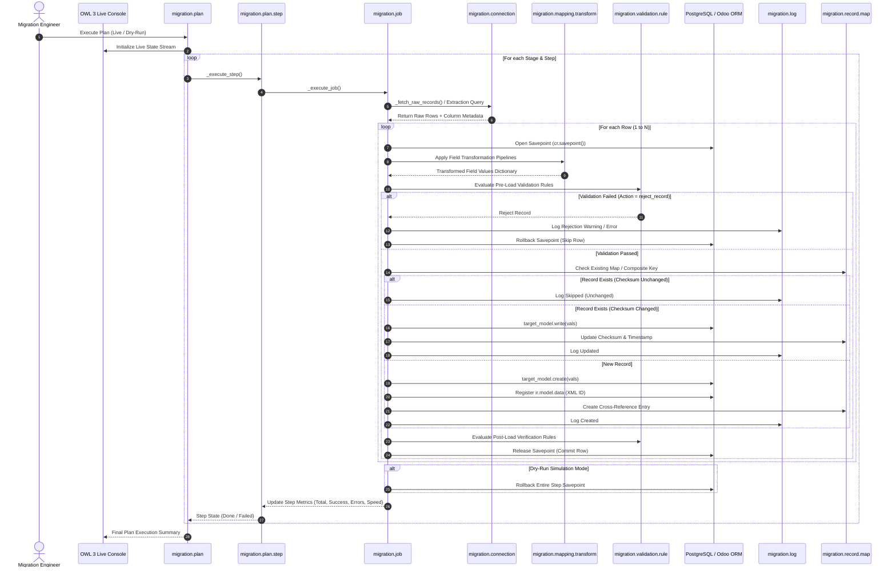
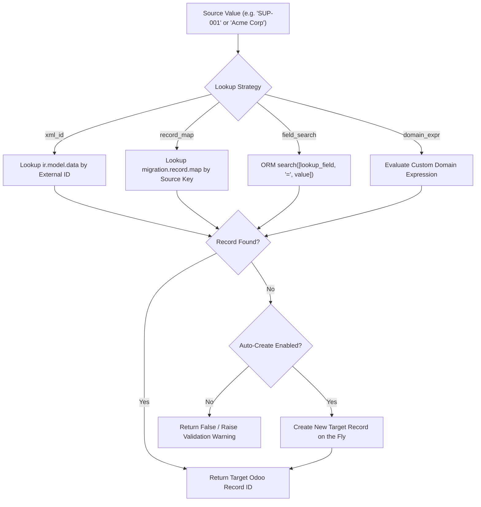

# Data Migration Studio - Technical Architecture & Core Principles

This document explains the internal mechanisms, transaction management, data integrity guarantees, and sequence workflows of **Data Migration Tools Studio**.

---

## 1. 6-Stage Pipeline Execution Flow



---

## 2. Zero-Failure Savepoint Isolation

One of the biggest pain points in enterprise data migration is when a single malformed row in a 50,000-row file crashes the entire transaction, rolling back thousands of previously processed records.

### How Data Migration Studio Solves This:
- Every record execution is encapsulated inside an isolated PostgreSQL savepoint:
  ```python
  with self.env.cr.savepoint():
      # All transformations, lookups, and ORM create/write calls happen here
  ```
- If an uncaught constraint error occurs (e.g. unique constraint violation, foreign key failure, invalid date format), the database rolls back **only the changes made for that specific row**.
- The execution engine catches the exception, logs the complete traceback alongside the raw and transformed JSON payloads in `migration.log`, and immediately proceeds to row $N+1$.
- Batch progress commits occur periodically (every 100 records) to keep database locks minimal and memory footprints predictable.

---

## 3. MD5 Checksum Change Detection

To support efficient incremental migrations and recurring synchronizations, the module uses MD5 checksumming:

$$\text{Checksum} = \text{MD5}\left(\text{json.dumps}(row\_data, \text{sort\_keys}=\text{True})\right)$$

1. When a source record is processed, its MD5 hash is stored in `migration.record.map`.
2. On subsequent runs:
   - If the source record exists in Odoo and its MD5 checksum is identical, the ORM `write()` operation is skipped completely.
   - This reduces database write I/O by over **90%** on recurring synchronization jobs.

---

## 4. Incremental Watermark Delta Extraction

For high-volume SQL databases and API integrations, full table scans are inefficient.

1. The `migration.extraction` model records `last_watermark_value` (e.g. timestamp `'2026-08-27 10:00:00'` or sequential ID `150293`).
2. When executing the extraction query:
   - The query binds `:watermark` -> `WHERE updated_at > :watermark`.
   - The extractor tracks the maximum watermark value across all extracted rows.
3. Upon successful job completion, `last_watermark_value` is updated atomically.

---

## 5. Relational Resolution Strategy Hierarchy

When mapping relational fields (`Many2one`, `Many2many`, `One2many`), the engine evaluates lookup strategies in the following prioritized order:



---

## 6. AI Integration & Fault Tolerance

The AI subsystem (`migration.ai.config`) is designed with resilience:
- **Zero Third-Party Dependencies**: Native implementation using Python's standard `urllib.request` and `ssl` modules.
- **Provider Redundancy**: Supports OpenAI, Gemini, Claude, and Local Ollama with identical API interfaces.
- **JSON Mode Guarantee**: Prompts enforce strict JSON output with automatic regex fallback sanitization (`re.search(r'\{.*\}', res, re.DOTALL)`).
- **Timeout & Error Handling**: AI requests are bounded by timeouts with graceful fallback to heuristic defaults if an API quota or network error occurs.
