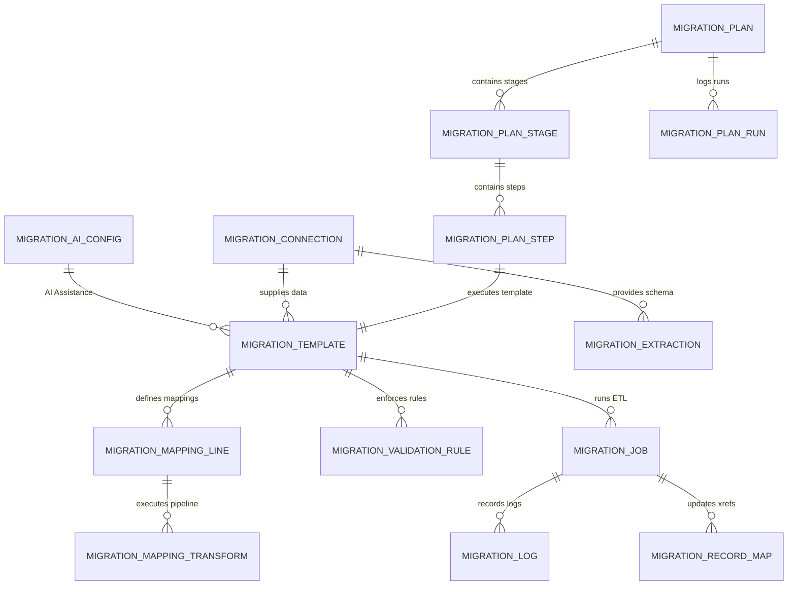

# Data Migration Studio - Developer & Extension Guide

This guide is designed for developers who wish to customize, extend, or integrate with **Data Migration Tools Studio** in Odoo 19 / 18.

---

## Table of Contents
1. [Module Architecture & Directory Structure](#1-module-architecture--directory-structure)
2. [Data Model Schema & Relationships](#2-data-model-schema--relationships)
3. [Extending Data Source Connectors](#3-extending-data-source-connectors)
4. [Adding Custom Transformation Operations](#4-adding-custom-transformation-operations)
5. [Integrating AI LLM Providers Programmatically](#5-integrating-ai-llm-providers-programmatically)
6. [Savepoint Transaction Isolation Pattern](#6-savepoint-transaction-isolation-pattern)
7. [Frontend Architecture (OWL 3 Components)](#7-frontend-architecture-owl-3-components)
8. [Writing Unit Tests](#8-writing-unit-tests)

---

## 1. Module Architecture & Directory Structure

```
data_migration/
├── models/
│   ├── migration_ai_config.py            # AI LLM provider configuration & API bridge
│   ├── migration_connection.py           # Multi-source connectors & schema discovery
│   ├── migration_extraction.py           # Queries, parameters, and watermark delta sync
│   ├── migration_template.py             # Field mappings, AI auto-map & quality audit
│   ├── migration_mapping_line.py         # Field pairs, relational lookups, pipeline runner
│   ├── migration_mapping_transform.py    # 11 transformation categories & Python sandbox
│   ├── migration_transform_template.py   # Reusable transformation presets
│   ├── migration_transform_template_step.py # Preset transformation step definitions
│   ├── migration_validation_rule.py      # Pre/post-load validation rules & evaluation
│   ├── migration_job.py                  # 6-Stage ETL Execution Engine with Savepoints
│   ├── migration_log.py                  # Granular audit stream with AI resolution
│   ├── migration_record_map.py           # Cross-system key resolution & MD5 checksums
│   ├── migration_plan.py                 # Multi-stage orchestrator & pre-flight checker
│   ├── migration_plan_stage.py           # Stages within a migration plan
│   ├── migration_plan_step.py            # Individual execution step linked to template
│   └── migration_plan_run.py             # Plan execution run history
├── wizards/
│   ├── migration_run_wizard.py           # Quick single-template execution wizard
│   └── migration_plan_run_wizard.py      # Multi-stage execution & simulation wizard
├── views/                                # Odoo 18/19 XML views (list, form, search, menus)
├── static/src/components/
│   ├── visual_mapper/                    # OWL 3 visual schema & pipeline builder
│   ├── migration_plan_console/           # OWL 3 real-time multi-stage execution console
│   └── migration_dashboard/              # OWL 3 executive ETL metrics dashboard
├── tests/                                # Automated unit test suites
├── doc/                                  # Documentation guides
└── __manifest__.py                       # Addon manifest declaration
```

---

## 2. Data Model Schema & Relationships



---

## 3. Extending Data Source Connectors

To add a new connection type (e.g. SAP HANA, Snowflake, HubSpot), inherit from `migration.connection` and extend the selection field and extraction method:

```python
# -*- coding: utf-8 -*-
from odoo import models, fields, api, _

class MigrationConnection(models.Model):
    _inherit = 'migration.connection'

    conn_type = fields.Selection(
        selection_add=[('snowflake', 'Snowflake Data Warehouse')],
        ondelete={'snowflake': 'set default'}
    )
    snowflake_warehouse = fields.Char(string='Warehouse')
    snowflake_database = fields.Char(string='Database')
    snowflake_schema = fields.Char(string='Schema')

    def _fetch_raw_records(self, limit=None):
        if self.conn_type == 'snowflake':
            return self._fetch_from_snowflake(limit=limit)
        return super()._fetch_raw_records(limit=limit)

    def _fetch_from_snowflake(self, limit=None):
        # Implementation using snowflake.connector
        import snowflake.connector
        ctx = snowflake.connector.connect(
            user=self.db_user,
            password=self.db_password,
            account=self.db_host,
            warehouse=self.snowflake_warehouse,
            database=self.snowflake_database,
            schema=self.snowflake_schema
        )
        cs = ctx.cursor(snowflake.connector.DictCursor)
        query = self.db_query or f"SELECT * FROM {self.snowflake_schema}.data"
        if limit:
            query += f" LIMIT {int(limit)}"
        cs.execute(query)
        rows = cs.fetchall()
        cs.close()
        ctx.close()
        columns = list(rows[0].keys()) if rows else []
        return rows, columns
```

---

## 4. Adding Custom Transformation Operations

To add new transformation logic, inherit from `migration.mapping.transform` and override `apply_transform`:

```python
# -*- coding: utf-8 -*-
from odoo import models, fields, api

class MigrationMappingTransform(models.Model):
    _inherit = 'migration.mapping.transform'

    transform_category = fields.Selection(
        selection_add=[('hash_sha256', 'SHA-256 Crypto Hash')],
        ondelete={'hash_sha256': 'set default'}
    )

    def apply_transform(self, raw_value, row_dict=None):
        if self.transform_category == 'hash_sha256':
            import hashlib
            if raw_value is None or raw_value is False:
                return ''
            return hashlib.sha256(str(raw_value).encode('utf-8')).hexdigest()
        return super().apply_transform(raw_value, row_dict=row_dict)
```

---

## 5. Integrating AI LLM Providers Programmatically

Use `migration.ai.config` to call configured LLMs with built-in JSON parsing and SSL handling:

```python
# Retrieve default AI provider
ai_config = self.env['migration.ai.config'].get_default_provider()
if not ai_config:
    raise UserError(_("No AI Provider configured."))

# Call with JSON mode for structured data extraction
result = ai_config.call_ai_completion(
    prompt="""
    Parse this address into JSON fields (street, city, state_code, zip, country_code):
    '450 Serra Mall, Stanford, CA 94305, USA'
    """,
    system_prompt="You are a data cleansing assistant. Output strict JSON only.",
    json_mode=True
)

# result is a Python dict:
# {
#     "street": "450 Serra Mall",
#     "city": "Stanford",
#     "state_code": "CA",
#     "zip": "94305",
#     "country_code": "US"
# }
```

---

## 6. Savepoint Transaction Isolation Pattern

The execution engine in `migration.job` uses **Savepoint Isolation** to guarantee that invalid rows never fail an entire migration batch:

```python
for idx, row in enumerate(records):
    source_key = self._extract_source_key(row, key_lines, idx + 1)
    
    # Savepoint per record
    try:
        with self.env.cr.savepoint():
            # 1. Transformation Pipeline
            transformed_vals, drop_row = self._apply_transformations(mapping_lines, row)
            if drop_row:
                continue

            # 2. Pre-Load Validation Rules
            passed, err_msg, action = self._validate_rules(pre_load_rules, transformed_vals, row)
            if not passed:
                if action == 'reject_record':
                    # Skip row and log error
                    self._log_error(idx + 1, source_key, err_msg, row, transformed_vals)
                    continue
                elif action == 'abort_stage':
                    raise UserError(_("Validation Abort: %s") % err_msg)

            # 3. Data Loading (Create or Update)
            res_status, target_id, msg = self._load_single_record(...)

            # 4. Checksum & Record Cross-Reference
            self._create_record_map(template, source_key, target_id, row_checksum)

    except Exception as e:
        # Savepoint automatically rolled back for this specific row!
        # The rest of the batch continues execution safely.
        self._log_error(idx + 1, source_key, str(e), row, traceback=traceback.format_exc())
```

---

## 7. Frontend Architecture (OWL 3 Components)

All frontend components adhere to Odoo 19 / OWL 3 directives:
- **`t-out`** is used for dynamic text interpolation (OWL 3 requirement; never `t-esc`).
- **Plain prop syntax** is used on component tags (no `t-att-*` on custom component tags).
- **SVG Bezier Connectors**: Dynamically calculates cubic bezier curves between source column DOM ports and target field DOM ports on window resize or scroll.

### Registering Custom Views / Actions
Components are registered in the Odoo registry:

```javascript
import { registry } from "@web/core/registry";
import { VisualMapperWidget } from "./visual_mapper";

registry.category("view_widgets").add("visual_mapper", {
    component: VisualMapperWidget,
});
```

---

## 8. Writing Unit Tests

Unit tests inherit from `odoo.tests.common.TransactionCase`.

### Example Test Suite:
```python
# -*- coding: utf-8 -*-
from odoo.tests import common

class TestMyCustomETL(common.TransactionCase):

    def test_custom_transformation(self):
        mapping_line = self.env['migration.mapping.line'].create({
            'template_id': self.template.id,
            'source_field': 'custom_code',
            'target_field_id': self.name_field.id,
        })
        transform = self.env['migration.mapping.transform'].create({
            'line_id': mapping_line.id,
            'transform_category': 'slugify',
        })
        res = transform.apply_transform("My Test SKU #123")
        self.assertEqual(res, "my_test_sku_123")
```
