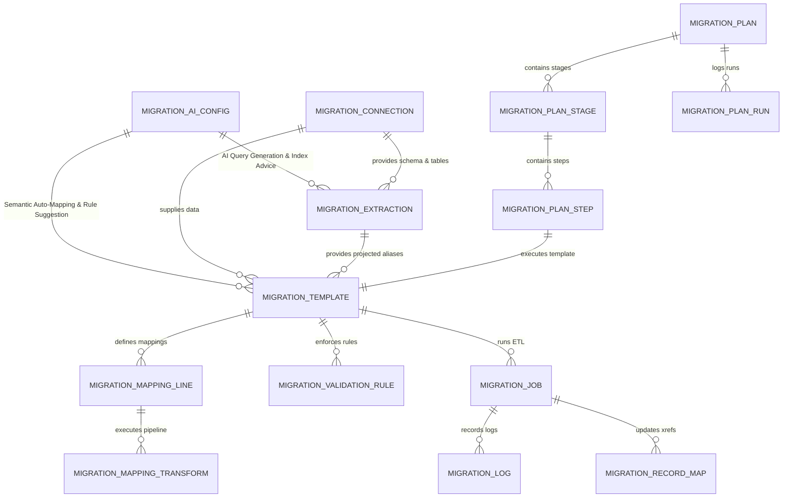

# Data Migration Studio - Developer & Extension Guide

This guide is designed for developers who wish to customize, extend, or integrate with **Data Migration Tools Studio** in Odoo 19 / 18.

---

## Table of Contents
1. [Module Architecture & Directory Structure](#1-module-architecture--directory-structure)
2. [Data Model Schema & Relationships](#2-data-model-schema--relationships)
3. [Extending Data Source Connectors & Schema Discovery](#3-extending-data-source-connectors--schema-discovery)
4. [Extraction Engine & Visual Query Builder API](#4-extraction-engine--visual-query-builder-api)
5. [Adding Custom Transformation Operations](#5-adding-custom-transformation-operations)
6. [Integrating AI LLM Providers Programmatically](#6-integrating-ai-llm-providers-programmatically)
7. [Savepoint Transaction Isolation Pattern](#7-savepoint-transaction-isolation-pattern)
8. [Frontend Architecture (OWL 3 Components)](#8-frontend-architecture-owl-3-components)
9. [Writing Automated Unit Tests](#9-writing-automated-unit-tests)

---

## 1. Module Architecture & Directory Structure

```
data_migration/
├── models/
│   ├── migration_ai_config.py            # AI LLM provider configuration & API bridge
│   ├── migration_connection.py           # Multi-source connectors & schema introspection
│   ├── migration_extraction.py           # Visual query builder, SQL safety & delta watermarks
│   ├── migration_template.py             # Field mappings, AI auto-map & quality audit
│   ├── migration_mapping_line.py         # Field pairs, relational lookups, pipeline runner
│   ├── migration_mapping_transform.py    # 11 transformation categories & Python sandbox
│   ├── migration_transform_template.py   # Reusable transformation presets
│   ├── migration_transform_template_step.py # Preset transformation step definitions
│   ├── migration_validation_rule.py      # Pre/post-load validation rules & evaluation
│   ├── migration_job.py                  # 6-Stage ETL Execution Engine with Savepoints
│   ├── migration_log.py                  # Granular audit stream with AI resolution
│   ├── migration_record_map.py           # Cross-system key resolution & MD5 checksums
│   ├── migration_plan.py                 # Multi-stage orchestrator & pre-flight checker
│   ├── migration_plan_stage.py           # Stages within a migration plan
│   ├── migration_plan_step.py            # Individual execution step linked to template
│   └── migration_plan_run.py             # Plan execution run history
├── wizards/
│   ├── migration_run_wizard.py           # Quick single-template execution wizard
│   └── migration_plan_run_wizard.py      # Multi-stage execution & simulation wizard
├── views/                                # Odoo 18/19 XML views (list, form, search, menus)
│   ├── migration_extraction_views.xml    # Extraction query list, search, and form views
│   ├── migration_connection_views.xml    # Connection forms and schema viewer
│   ├── migration_template_views.xml      # Mapping template form and visual mapper tab
│   └── ...
├── static/src/components/
│   ├── visual_extraction_builder/        # OWL 3 Visual Query & Field Selector widget
│   ├── visual_mapper/                    # OWL 3 visual schema & pipeline builder
│   ├── migration_plan_console/           # OWL 3 real-time multi-stage execution console
│   └── migration_dashboard/              # OWL 3 executive ETL metrics dashboard
├── tests/                                # Automated unit test suites
├── doc/                                  # Architecture, Developer & User documentation
└── __manifest__.py                       # Addon manifest declaration
```

---

## 2. Data Model Schema & Relationships



---

## 3. Extending Data Source Connectors & Schema Discovery

To add a new connection type (e.g. Snowflake, MongoDB, BigQuery), inherit from `migration.connection`, extend the `conn_type` selection, and implement both record extraction and schema discovery:

```python
# -*- coding: utf-8 -*-
from odoo import models, fields, api, _

class MigrationConnection(models.Model):
    _inherit = 'migration.connection'

    conn_type = fields.Selection(
        selection_add=[('snowflake', 'Snowflake Data Warehouse')],
        ondelete={'snowflake': 'set default'}
    )
    snowflake_warehouse = fields.Char(string='Warehouse')
    snowflake_database = fields.Char(string='Database')
    snowflake_schema = fields.Char(string='Schema')

    def _fetch_raw_records(self, limit=None):
        if self.conn_type == 'snowflake':
            return self._fetch_from_snowflake(limit=limit)
        return super()._fetch_raw_records(limit=limit)

    def inspect_source_schema(self):
        """Discovers tables and columns for the Visual Extraction Studio."""
        if self.conn_type == 'snowflake':
            return self._inspect_snowflake_schema()
        return super().inspect_source_schema()

    def _inspect_snowflake_schema(self):
        # Implementation querying Snowflake INFORMATION_SCHEMA.TABLES / COLUMNS
        # Returns: {'conn_type': 'snowflake', 'tables': [{'name': '...', 'columns': [...]}]}
        pass
```

---

## 4. Extraction Engine & Visual Query Builder API

The `migration.extraction` model provides high-level programmatic methods for query compilation, safety validation, live testing, and AI optimization:

### Query Compilation & Safety Validation
```python
extraction = self.env['migration.extraction'].create({
    'name': 'Customers Extraction',
    'connection_id': conn.id,
    'selected_table': 'legacy_customers',
    'use_visual_builder': True,
    'selected_fields_json': json.dumps([
        {'field': 'id', 'alias': 'customer_id', 'cast': 'integer', 'selected': True},
        {'field': 'name', 'alias': 'full_name', 'cast': 'varchar', 'selected': True},
    ]),
    'where_clauses_json': json.dumps([
        {'field': 'active', 'operator': '=', 'value': '1', 'conjunction': 'AND'}
    ]),
})

# Compile SQL query:
sql = extraction.compile_query_from_visual()
# Returns: "SELECT CAST(id AS integer) AS customer_id, CAST(name AS varchar) AS full_name\nFROM legacy_customers\nWHERE active = 1"

# Read-only validation guard:
extraction._validate_query_safety(sql)  # Raises UserError if DROP/DELETE/UPDATE/INSERT are present
```

### Live Preview Sandbox API
```python
# Execute sample preview without updating watermark
preview = extraction.run_preview_extraction(limit=10)
# Returns:
# {
#     'success': True,
#     'records': [...],
#     'columns': ['customer_id', 'full_name'],
#     'total_extracted': 10,
#     'latency_ms': 14.5
# }
```

### AI Optimization & Advisory API
```python
# 1. Generate query from Natural Language prompt:
res = extraction.action_ai_generate_query("Extract active vendors in California with orders in 2025")

# 2. Analyze query performance and get source index recommendations:
opt = extraction.action_ai_optimize_query()
print(extraction.ai_optimization_notes)
# Contains index recommendations (e.g. CREATE INDEX idx_orders_date ON ...)

# 3. Suggest optimal watermark column:
wm = extraction.action_ai_advise_watermark()
print(f"Optimal column: {wm['watermark_column']}")
```

---

## 5. Adding Custom Transformation Operations

To add new transformation logic, inherit from `migration.mapping.transform` and override `apply_transform`:

```python
# -*- coding: utf-8 -*-
from odoo import models, fields, api

class MigrationMappingTransform(models.Model):
    _inherit = 'migration.mapping.transform'

    transform_category = fields.Selection(
        selection_add=[('hash_sha256', 'SHA-256 Crypto Hash')],
        ondelete={'hash_sha256': 'set default'}
    )

    def apply_transform(self, raw_value, row_dict=None):
        if self.transform_category == 'hash_sha256':
            import hashlib
            if raw_value is None or raw_value is False:
                return ''
            return hashlib.sha256(str(raw_value).encode('utf-8')).hexdigest()
        return super().apply_transform(raw_value, row_dict=row_dict)
```

---

## 6. Integrating AI LLM Providers Programmatically

Use `migration.ai.config` to call configured LLMs with built-in JSON parsing and SSL handling:

```python
# Retrieve default AI provider
ai_config = self.env['migration.ai.config'].get_default_provider()
if not ai_config:
    raise UserError(_("No AI Provider configured."))

# Call with JSON mode for structured data extraction
result = ai_config.call_ai_completion(
    user_prompt="""
    Parse this address into JSON fields (street, city, state_code, zip, country_code):
    '450 Serra Mall, Stanford, CA 94305, USA'
    """,
    system_prompt="You are a data cleansing assistant. Output strict JSON only.",
    json_mode=True
)
```

---

## 7. Savepoint Transaction Isolation Pattern

The execution engine in `migration.job` uses **Savepoint Isolation** to guarantee that invalid rows never fail an entire migration batch:

```python
for idx, row in enumerate(records):
    source_key = self._extract_source_key(row, key_lines, idx + 1)
    
    # Savepoint per record
    try:
        with self.env.cr.savepoint():
            # 1. Transformation Pipeline
            transformed_vals, drop_row = self._apply_transformations(mapping_lines, row)
            if drop_row:
                continue

            # 2. Pre-Load Validation Rules
            passed, err_msg, action = self._validate_rules(pre_load_rules, transformed_vals, row)
            if not passed:
                if action == 'reject_record':
                    self._log_error(idx + 1, source_key, err_msg, row, transformed_vals)
                    continue
                elif action == 'abort_stage':
                    raise UserError(_("Validation Abort: %s") % err_msg)

            # 3. Data Loading (Create or Update)
            res_status, target_id, msg = self._load_single_record(...)

            # 4. Checksum & Record Cross-Reference
            self._create_record_map(template, source_key, target_id, row_checksum)

    except Exception as e:
        # Savepoint automatically rolled back for this specific row!
        # The rest of the batch continues execution safely.
        self._log_error(idx + 1, source_key, str(e), row, traceback=traceback.format_exc())
```

---

## 8. Frontend Architecture (OWL 3 Components)

All frontend components adhere to Odoo 19 / OWL 3 directives:
- **`t-out`** is used for dynamic text interpolation (OWL 3 requirement; never `t-esc`).
- **Plain prop syntax** is used on component tags (no `t-att-*` on custom component tags).
- **Widgets Registered in `view_widgets`**:
  - `visual_extraction_builder`: Visual query & field selector widget.
  - `visual_mapper`: Drag-and-drop schema mapper widget.

```javascript
import { registry } from "@web/core/registry";
import { VisualExtractionBuilder } from "./visual_extraction_builder";

registry.category("view_widgets").add("visual_extraction_builder", {
    component: VisualExtractionBuilder,
});
```

---

## 9. Writing Automated Unit Tests

Unit tests inherit from `odoo.tests.common.TransactionCase`.

### Example Test Case:
```python
# -*- coding: utf-8 -*-
from odoo.tests import common
from odoo.exceptions import UserError

class TestCustomExtraction(common.TransactionCase):

    def test_query_safety(self):
        extraction = self.env['migration.extraction'].create({
            'name': 'Test Extraction',
            'connection_id': self.conn.id,
        })
        with self.assertRaises(UserError):
            extraction._validate_query_safety("DROP TABLE customers;")
```
